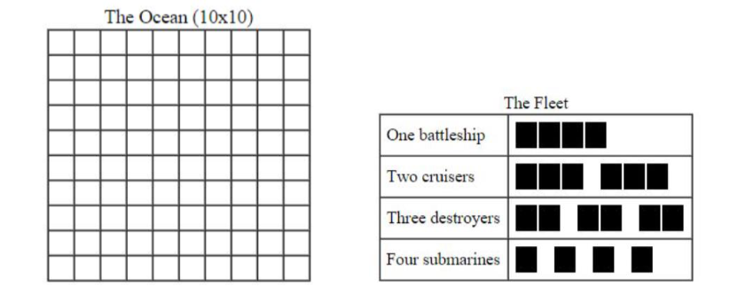
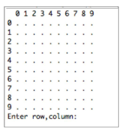

# Battleship海战棋

**项目相关主题**
+ 继承与重载
+ 访问修饰符
+ 抽象类
+ 二维数组

## 介绍
我们将想你展示如何构建一个简易版本的经典游戏——— Battleship海战旗。

海战棋通常由两个玩家进行，每名玩家有一支舰队和一篇海洋(这对另一名玩家是隐藏的)，并尝试成为第一个击沉其他玩家舰队的人。

我们要做的只是一个玩家和电脑对抗，由电脑来放置船只，人类来尝试击沉他们。

在游戏中，我们将有一个10*10的海洋以及下列船只作为舰队:

## 如何游玩海战棋

请看看这些规则，即使你以前玩过海战棋。

请记住，这是一个人类与电脑对抗的版本.

电脑会放置 **10艘舰艇**在海上，并确保船只间彼此互不接触，无论是水平、垂直还是对角线。如下所示:

人类玩家并不知道船只在哪。因此，输出在控制台上的海洋初始的显示应为一个**10\*10**的‘.’数组。(关于*Ocean*类的*print()*方法的详细内容将在后序显示)

人类玩家尝试通过一个特定的行号和列号(r,c)来击中船只。电脑将"hit"或"miss"作为反馈的信息。

当一艘船被击中，但未沉没，程序不会提供任何关于什么船被击中的信息。但是，当一艘船被击中并沉没，程序将输出一条消息"You just sank a ship -(type of this ship)"。在每一次射击后，电脑将根据新的信息重新打印海洋。

当一艘船的所有格子都被击中，则该船沉没。因此，击沉一艘战列舰需要四次(四个不同的地方)，击沉一艘巡洋舰需要三次，击沉一艘驱逐舰需要两次，击沉一艘潜艇需要一次。

目标是尽可能用少的射击次数来击沉舰队，最好的分数的20分(分数越低越好)。当所有的船被击沉时，程序会打印出一条消息，游戏结束，并告知你需要多少次射击。

## 实施细节

命名你的**project**为Battleship，你的**package**为battleship。

你的程序应该有以下8个类:
- class BattleshipGame
    - 这是一个"main" class,包含一个从创建一个Ocean实例开始的main方法。
- class Ocean
    - 这包含一个10\*10的**Ships**数组，代表一个海洋，和一些操控它的方法。
- abstract class Ship
    - 这个abstrat类描述了所有舰艇的共有特征。
    - 它有子类:
        - class Battleship extends Ship
            - 描述一条长为4的船
        - class Cruiser extends Ship
            - 描述一条长为3的船
        - class Destroyer extends Ship
            - 描述一条长为2的船
        - class Submarine extends Ship
            - 描述一条长为1的船
        - class EmptySea extends Ship
            - 描述海洋中没有船的部分。
## abstract class Ship

abstract class Ship 具有以下几个实例变量。

- private int bowRow
    - 包含船首的行
- private int bowColumn
    - 包含船首的列
- private int length
    - 船的长度
- private boolean horizontal
    - 一个布尔值，表示船是水平还是垂直放置
    - True 为水平放置
    - False 为垂直放置
- private boolean[] hit
    - 一组布尔值，表示该部分是否被击中。
    - True 为击中，False为未击中。

Ship类的默认构造函数:

- public Ship(int length)
    - 此构造函数设定特定的船的长度属性，并根据该长度初始化命中数组。

Ship 类中的方法如下:

**获取信息**
- public int getLength()
    - 返回船的长度
- public int getBowRow()
    - 返回与船首位置对应的行
- public int getBowColumn()
    - 返回与船首位置对应的列
- public boolean[] getHit()
    - 返回hit数组
- public boolean isHorizontal()
    - 返回船是否是水平的

**设置信息**

- public void setBowRow(int row)
    - 设置船首行值
- public void setBowColumn(int column)
    - 设置船首列值
- public void setHorizontal(boolean horizontal)
    - 设置船是否水平的值

抽象方法:
- public abstract String getShipType()
    - 以字符串形式返回船舶的类型。每种特定类型的船舶(如:BattleShip、Cruiser等)必须重写并实现此方法返回相应的船型。

其他方法:

- boolean okToPlaceShopAt(int row,int column,boolean Horizontal,Ocean ocean)
    -   基于给定的行、列和方向，如果可以放置则返回  true,否则返回false
- void placeShipAt(int row,int column,boolean Horizontal,Ocean ocean)
    - 将船放入海洋。这涉及到给bowRow、bowColumn和horizontal赋值。
    - 我们将统一船首的位置，当船水平放置时，船首在右端。当船垂直放置时，船首在底端。
- boolean shootAt(int row,int column)
    - 如果船的一部分占据了给定的行和列，且船没有沉没，则将船的这部分标记为"hit"并返回True;否则返回false
- boolean isSunk()
    - 若船的每一部分都被击中，则返回true，否则返回false
- @Override 
  public String toString()
    - 返回在Ocean类的print方法中使用的单字字符串。这个方法应该在船已沉没时返回"s"，在船未沉没时返回"x"。这个方法可用来输出在海洋中被射击的位置;它不应该用于输出未被射击的位置。由于toString方法在所有类型的船中的行为都完全相同，因而放于Ship类中。
## **Class** BattleshipGame

class BattleshipGame 是一个主类，即在里面包含一个main方法。在这个类里，你将开始游戏:从用户接受射击；展示结果；并输出最终分数。所有的输入和输出都在这里完成。 
为帮助用户，行号应显示在数组的左边缘，列号应显示在数组的上边缘。数字从**0到9**左上角的区域应为(0，0)。使用不同的字符来指示命中位置、未命中的位置和未射击的位置。 
如下图所示，为首次启动的海洋显示，没有被开火射击过。

使用多样的方法，不要把所有东西都塞在一个或两个方法中，尝试将总做分成合理的部分。
## Extending abstract class ship

使用abstract Ship 类作为每个船类型的父类。创建以下类并将每个类保存于一个单独的文件中。 
+ class Battleship extends Ship
+ class Cruiser extends Ship
+ class Destroyer extends Ship
+ class Submarine extends Ship

每个类中都有一个零参数公共构造函数，目的是将长度值设置为正确的值。

除了构造函数外，还需要重写此方法:
- @Override 
  public String getShipType()
  - 返回字符串"battleship","cruiser","destroyer","submarine"中的一个，这些值适合写在static final值中。
  - 此方法可用于在任何给定的时间地点识别正在处理的船舶类型，并无需使用instanceof

## **class** EmptySea **extends**Ship

Ocean包含一个Ship数组，每个位置都是(或可以是)对某个Ship的引用。若某个特定位置为空，最简单的做法是在该位置上放置一个空值。但这会导致每次查看时都必须检查它是否为空。在空位置放置一个非空值，表示没有船，可以省去所有空值检查。 
class EmptySea 的构造函数:
- public EmptySea()
    - 这个零参数构造函数通过调用超累中的构造函数将长度设置为1
class EmptySea的方法如下:
- @Override 
boolean shootAt(int row,int column)
    - 此方法覆盖从Ship继承的shootAt(int row,int column),并始终返回false表示没有命中任何内容
- @Override 
boolean isSunk()
    - 此方法覆盖从Ship继承的isSunk(),并始终返回false表示没有击沉任何东西
- @Override 
public String toString()
    - 返回单字符"-"，用以在Ocean类的print方法使用。意为射击但没有击中。
- @Override 
public String getShipType()
    - 此方法返回字符串"Empty"

## **Class** Ocean

实例变量 
- private Ship[][] ships = new Ship[10][10]
    - 用于快速的确定某一位置是哪搜船
- private int shotsFired
    - 用户的总射击数量
- private int hitCount
    - 炮弹射中船只的次数。即使用户多次射击同一个部分，命中都会被计算在内，即使额外的命中对用户没有任何好处。
- private int shipsSunk
    -沉船数量(共10艘)

**构造函数**

- public Ocean()
    - 创建一个空海洋，并用EmptySea对象填充ships数组。
    - 初始化其他的游戏变量

**方法**

- void placeAllShipsRandomly()
    - 将所有的十艘船随机放置在海洋上。在放小船前先放置大船，以防止没有合法的地方放置大船
- boolean isOccupied(int row,int column)
    - 若给定的位置含有一艘船，则返回true，否则返回false
- boolean shootAt(int row,int column)
    - 如果给定的位置上有一艘"真的"船，任然在漂浮，则返回true(不是EmptySea)，否则为false。此外，此方法还会更新已开炮的次数和命中次数。
    - 注意: 如果这个位置包含一艘真实的船，那么当用户向同一位置开火都应该返回true,但一旦沉没，在这个位置的额外射击应该返回false。
- int getShotsFired()
    - 返回开火次数
- int getHitCount()
    - 返回命中数。包括所有的命中，而不仅仅是第一次命中给定的区域。
- int getShipsSunk()
    - 返回沉没船只数
- boolean isGameOver()
    - 如果所有船只都沉没则返回true，否则返回false。
- Ship[][] getShipArray()
    - 返回10x10的Ship数组。Ship类中采用Ocean参数的方法需要能够查看该数组的内容；placeShipAt()方法甚至需要修改它。
- void print()
    - 打印Ocean,为帮助用户，行号显示于数组的左边缘，列号显示在上边缘。数字从0-9。
    - 左上方的区域应为(0,0)
    - 'x':用来表示您已开火并击中的位置。
    - '-':用来表示您开火但未击中任何东西的位置。
    - 's': 表示沉船位置(参考Ship类中toString的描述)。
    - '.':表示您从未开火的位置。
    - 这是Ocean类中唯一执行任何输入/输出的方法，永远不会从Ocean类中调用,只能从BattleshipGame类中调用。